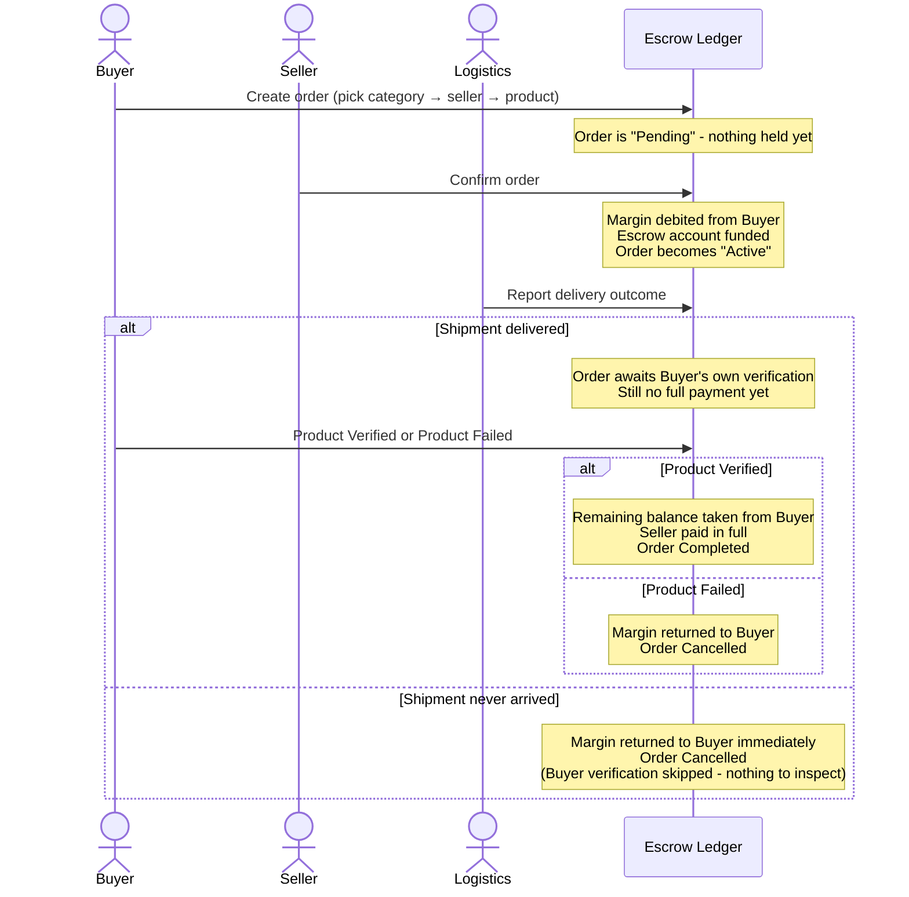

# Smart Escrow — How It All Works

A plain-language walkthrough of the whole platform: who does what, what happens to the money at
every step, and what each screen actually shows. No source code required.

## The Idea, In One Paragraph

A Buyer wants to order something from a Seller, but neither one fully trusts the other yet — the
Buyer doesn't want to pay in full before the goods arrive, and the Seller doesn't want to ship
before getting paid. The platform sits in the middle: it holds a percentage of the money
(the "margin") in a neutral escrow account the moment the Seller agrees to the order, and only
releases the full payment once an independent Logistics party confirms delivery **and** the Buyer
personally confirms the product was actually acceptable. If anything goes wrong along the way,
the money goes back to the Buyer instead.

## The Three Roles

| Role | Who they are | What they can do |
|---|---|---|
| **Buyer** | The one placing the order | Browse sellers by category, create orders, verify delivered products, view their own wallet |
| **Seller** (Supplier) | The one fulfilling the order | List products with a price and margin, confirm incoming orders, view their own wallet |
| **Logistics** | An independent delivery tracker — not the Buyer, not the Seller | Report whether a shipment was delivered or failed |

Logistics is deliberately a separate role from Seller. If the Seller could confirm their own
delivery, that would just be them vouching for themselves — the whole point of using an
independent Logistics check is that the party being paid never gets to certify their own
delivery.

## The Full Order Lifecycle

### Step by step

1. **Buyer creates an order.** They pick a category, then a seller who sells in that category,
   then one of that seller's products. The order amount and the escrow margin percentage are
   whatever the seller set on that product — the buyer can't change them. At this point the order
   is just a request: **nothing has been held or moved yet.**

2. **Seller confirms the order.** This is the moment money first moves. The seller's margin
   percentage (e.g. 10%) is taken out of the buyer's balance and placed into a separate,
   neutral escrow account — not the seller's account, not the buyer's account, a third one that
   belongs to neither. The remaining amount (e.g. 90%) is *not* taken yet — it's still sitting in
   the buyer's own balance, just earmarked as "committed" to this order.

3. **Logistics reports the delivery outcome.** Logistics is the only one who can do this, and
   only once the seller has confirmed. Two outcomes:
   - **Delivered** — the package physically arrived. This does **not** release any money by
     itself. It just moves the order into "awaiting the buyer's own decision."
   - **Failed** — the shipment never arrived, or was lost. The escrow margin is immediately
     returned to the buyer, and the order is cancelled. There's nothing for the buyer to inspect
     in this case, so their decision step is skipped entirely.

4. **Buyer verifies the product (only after Delivered).** Once Logistics says the package
   arrived, only the buyer gets to decide what actually happens with the money:
   - **Product Verified** — the remaining balance is now taken from the buyer, the escrow
     account is emptied, and the seller is paid the full order amount in one go. The order is
     marked Completed.
   - **Product Failed** — the escrow margin is returned to the buyer instead. The remaining
     balance was never touched in the first place, since it wasn't taken until this point. The
     order is marked Cancelled.

Logistics confirming a delivery only proves the box physically showed up — it says nothing about
whether what's inside is what was actually ordered, or in acceptable condition. Only the buyer,
having received it, can judge that. That's why the buyer gets the final say, not Logistics.

## Where The Money Actually Sits, At Each Step

| Stage | Buyer's own balance | Escrow account | Seller's balance |
|---|---|---|---|
| Order just created (Pending) | Full amount, untouched | Empty | Untouched |
| Seller confirms (Active) | Reduced by the margin only | Holds the margin | Untouched |
| Delivered, awaiting buyer decision | Same as above — remaining balance still just "earmarked", not moved | Still holds the margin | Untouched |
| Buyer says Product Verified | Reduced further, by the remaining amount | Emptied | Receives the full order amount |
| Buyer says Product Failed, or delivery failed | Back to the original full amount | Emptied | Untouched |

This is why the wallet page shows two different figures for a buyer:
- **"In Escrow"** — money that has genuinely already moved into the neutral escrow account.
- **"Held"** — money that's earmarked for a pending order but hasn't actually moved anywhere yet.
  It's still sitting in the buyer's own balance, just reserved.

## Wallet Balances, Explained

Every wallet's real balance lives on the underlying ledger, not in a regular database — it's
fetched live every time it's shown, so it can never go stale.

- **Available** — what's actually spendable right now.
- **Held** (Buyer only) — the remaining, not-yet-taken portion of active orders. Shown broken
  down per order, with which seller it's tied to, if there's more than one pending order.
- **In Escrow** (Buyer only) — the total margin currently sitting in escrow accounts across all
  active orders.

Sellers only see "Available" — held/escrow figures don't apply to them, since they're the ones
waiting to receive money, not the ones it's held from.

## A Tour Of Each Page

**Login** — Pick a role to continue as. Buyer and Seller register with a Wallet ID, a PIN (for
logging in), and a separate Account Number (a second, independent check needed specifically to
view wallet balances — being logged in alone isn't enough). Logistics has no login screen of its
own; it opens straight into a single, fixed Logistics identity, since it isn't a financial party.

**Dashboard** — A role-aware summary. Buyers and Sellers see order counts, active escrow value,
settlement value, and recent activity. Logistics sees a simplified version focused on orders
pending pickup vs. delivered, since it never holds or settles money itself.

**Create Order** *(Buyer only)* — A three-step picker: category → seller who sells in that
category → one of that seller's products in that category. The order amount and margin are shown
but can't be edited — they come from what the seller set on the product.

**My Orders** — Every order, filterable by status. Actions appear here based on who's looking and
what state the order is in:
- The seller who owns a still-unconfirmed order sees a **Confirm Order** button.
- The buyer who owns an order that's been delivered sees **Product Verified** / **Product
  Failed** buttons. These disappear once clicked — the outcome is final and shown as an updated
  status label instead.

**My Products** *(Seller only)* — A seller's own catalog: add a product with a category, price,
and their own chosen escrow margin percentage. A seller can list products across more than one
category.

**Logistics** — independent of Buyer/Seller — shows every order that's ready for a delivery
update (i.e. already confirmed by its seller). Mark Delivered or Mark Failed per order. The page
is explicit that Mark Delivered does not release funds by itself — it only starts the buyer's
verification step.

**Wallets** — View your own balance after entering your Account Number. Shape of what's shown
depends on role, as described above.

## Rules That Are Always Enforced, Not Just Suggested By The UI

These hold even if someone tries to call the system directly, not just click through the screens:

- Only the buyer who owns an order can verify its delivery. Only the seller who owns an order can
  confirm it. A different buyer or seller account, even a valid one, can't act on someone else's
  order.
- Logistics can't report a delivery outcome until the seller has confirmed. A buyer can't verify
  a delivery until Logistics has reported it as delivered.
- Once an order reaches a final outcome (Completed or Cancelled), it can't be acted on again —
  repeating an action on an already-resolved order is rejected with a clear message.
- An order's amount and margin always come from what the seller actually set on the product —
  never from anything the buyer's request claims.
- Viewing a wallet's balance needs two separate things: being logged in, *and* knowing that
  wallet's Account Number. Neither one alone is enough.

## Quick Glossary

| Term | Meaning |
|---|---|
| **Order Status: Pending** | Order exists, but the seller hasn't confirmed yet — nothing held |
| **Order Status: Active** | Seller confirmed, margin is held, order is in progress |
| **Order Status: Completed** | Buyer verified the product — seller has been paid in full |
| **Order Status: Cancelled** | Refunded to the buyer, for any reason (failed delivery, failed product, or buyer rejection) |
| **Fulfillment: Awaiting Confirmation** | Waiting on the seller |
| **Fulfillment: Confirmed** | Seller confirmed; waiting on Logistics |
| **Fulfillment: Awaiting Your Verification** | Delivered; waiting on the buyer's decision |
| **Fulfillment: Product Verified** | Buyer accepted it — this is what triggers final payment |
| **Fulfillment: Product Failed** | Buyer rejected it — this is what triggers the refund |
| **Fulfillment: Delivery Failed** | Logistics reported it never arrived — refunded automatically, no buyer step |
| **Settlement: Released** | Full payment has gone to the seller |
| **Settlement: Refunded** | Money has gone back to the buyer |
